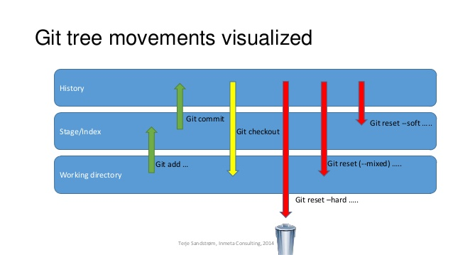

# Tricks

## Setup phase

### Ignore files
- Add those files to `.gitignore`
- To use specific template for specific project, take a look at https://github.com/github/gitignore

### Share git hooks with team
- Reason: git hooks stay in `.git`, hence not pushed to remote repository -> got to find a workaround to share these hooks with team
- Solution: create a folder called `scripts` or `.githooks` or `git-scripts` (or any name you want) in your local repo, and use
    - [RECOMMEND] config hooks path with 

        ```bash
        git config core.hooksPath <folder_name>
        ```

    - setup symlinks 

        ```bash
        ln -s <folder_name> ".git/hooks"
        ```
- SUPER TIP: Automate the sharing process by putting any githook setup to a script and ask your team to run it. Example:

    ```bash
    #!/bin/bash

    git config core.hooksPath <folder_name>
    ```
- Reference: 
    - https://stackoverflow.com/a/37861972

### Common aliases
- Add a new alias with format `{command} = {bash}` in `~/.gitconfig` file, under `[alias]` section

    ```
    [alias]
	    undo = reset --soft HEAD~1
    ```

- A nice aliase sample file is: [here](./.gitconfig.aliases.sample)
- References: 
    - https://opensource.com/article/20/11/git-aliases
    - https://gist.github.com/GaetanoPiazzolla/3715ea8836154a84a545b97f62769300

## Push

### Push an empty folder
- Git will ignore empty folder when we're pushing to a repo. Hence, we can put anything inside that folder to make sure it appears in the remote repo
- Some convention for that "anything" would be ".gitkeep" or ".keep"
- Example

    ```
    ---folder A
    |
    -----.gitkeep
    ```
- References: https://www.freecodecamp.org/news/what-is-gitkeep/

### Run test before pushing
- Use `pre-push GIT HOOKS`. 
- Example: Write test command to the file `.git/hooks/pre-push`
- However, a better practice would be use `pre-commit`, which is running hooks before committing
- For more detail, visit [here](../terms/githooks.md)
- Reference: 
    - `pre-push`: https://benfrain.com/a-git-pre-push-hook-to-run-tests-on-a-particular-branch-when-you-push/
    - `pre-commit`: https://blog.devgenius.io/automate-unit-tests-before-each-commit-by-git-hook-f331f0499786
- Notes: team should not rely comprehensively on githooks because: 
    - Really easy to bypass githooks with `--no-verify`
    - githooks stay in `.git`, which is not shared between teams
    - Enforcement should come from the remote repository
- Alternative for `githooks` is finding [support from IDE](https://www.jetbrains.com/go/guide/tips/vcs-run-tests-before-commit/)

### Skip git hooks when committing/pushing
- Use `--no-verify`
- Example
    - Skip `pre-commit`:
        ```bash
        git commit --no-verify -m "commit message"
        ```
    
    - Skip `pre-push`:
        ```bash
        git push --no-verify
        ```
- However, some commands such as `cherry-pick` does not support `--no-verify`. The easiest bypass solution is to comment those hooks temporarily.
- Reference: https://stackoverflow.com/questions/7230820/skip-git-commit-hooks

## Commit
### Edit the latest commit message
- Use command `git commit --amend -m "New commit message"`
- Reference: https://linuxize.com/post/change-git-commit-message/

### Edit the latest commit message that had been pushed
- Need to force push after amending the commit `git push --force <remoteName> <branchName>`
- Reference: https://linuxize.com/post/change-git-commit-message/

### Better commit message
- Use gitmoji: https://github.com/carloscuesta/gitmoji
    - Example: use vscode extension: https://github.com/seatonjiang/gitmoji-vscode
- Rules for writing good commit message:
    - write as giving order: start the sentence with verb
    - prefix with commit type, e.g., Bugfix, Update
    - NO filler words, e.g., I think
- Answer these questions when writing commit:
    - Why is these changes needed?
    - What are the changes in reference to?
- Some recommended commit types:
    - feat: new feature
    - fix: bug fix
    - refactor: clean & refactor code
    - docs: add/update documentation
    - test: add/update tests
    - perf: improve performance
    - ci: CI/CD related
- Examples of good commit message: 
    - feat: improve performance with lazy load implementation for images
    - fix: bug preventing users from submitting the subscribe form
- Examples of bad commit message:
    - fixed bug on landing page
    - oops
    - tmp
    - test
- Reference: https://www.freecodecamp.org/news/how-to-write-better-git-commit-messages/

### Multiple-line commit message
- Do not close the quote & hit 'enter'

    ```bash
    git commit -m "1. first changed
    2. second changed
    "
    ```

- Another solution is using multiple `-m`

    ```bash
    git commit -m "1. first changed" -m "2. second changed"
    ```

- To view result, use `git log` (do not use `git log --oneline` because it will truncate the newlines). The content will be like:

    ```
    commit 9d7...bc8 (HEAD -> main)
    Author: author_name <author_email>
    Date:   Wed Oct 11 14:00:51 2023 +0700

        1. first changed
        2. second changed
    ```

    Note that, using multiple `-m` will create double newlines

    ```
    commit 9d7...bc8 (HEAD -> main)
    Author: author_name <author_email>
    Date:   Wed Oct 11 14:00:51 2023 +0700

        1. first changed

        2. second changed
    ```

- References: 
    - https://stackoverflow.com/a/29934000
    - https://stackoverflow.com/a/42078093

### Undo the last commit
- Use `reset`

    ```bash
    git reset --soft HEAD~1
    ```
- SUPER TIPS: Add alias by writing to `~/.gitconfig`
    ```
    [alias]
        undo = reset --soft HEAD~1
    ```

    Then you can use `git undo` everywhere in your machine.

- Note: `--soft` will only revert commit and keep changes in staged state. 
    - to make changes in unstaged state: use `--mixed`
    - to delete changes entirely: use `--hard`

    
    
- Advice: `git reset` should be used for non-pushed commits. For public commits, we should add a commit announcing that changes had been reverted. This can be done via `git revert`

- Reference: https://dev.to/isabelcmdcosta/how-to-undo-the-last-commit--31mg#comment-2bo1

### Undo a public commit
- Reason: use `git reset` is only recommended for non-pushed commits. But in the case of published commits, we should create a new commit for undoing any previous changes
- Use `revert`

    ```bash
    git revert <commit_hash>
    ```

    Example: `git revert 57e62f0`
- More examples: 

    ```bash
    # revert latest commit
    git revert HEAD

    # revert second latest commit 
    git revert HEAD~1
    ```

- References: 
    - https://dev.to/isabelcmdcosta/how-to-undo-the-last-commit--31mg


## Others

### View a file of another branch
- Use command `git show`. The format is 

    ```
    git show <branch_name>:<file_path>
    ```

- Example: 

    ```
    git show main:README.md
    ```

- Reference: https://opensource.com/article/20/10/advanced-git-tips

## TODO
- revert a commit by hash
- cherry pick
- global gitignore
- write a script to prepare tips needed for a project, e.g., prepare githooks, config aliases

- Ref: 
    - https://gist.github.com/hofmannsven/6814451
    - https://github.com/RehanSaeed/Git-Cheat-Sheet
    - https://gist.github.com/luismts/495d982e8c5b1a0ced4a57cf3d93cf60
    - https://github.com/git-tips/tips